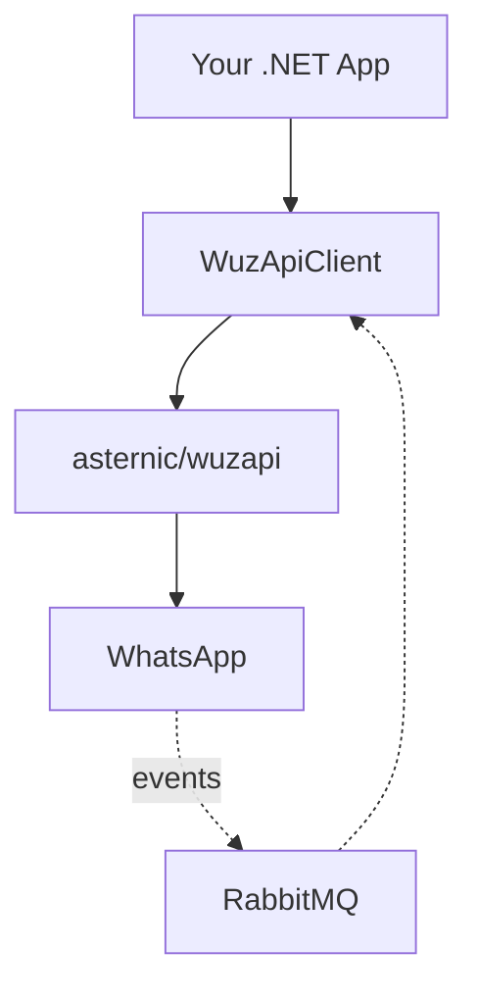

# WuzAPI Client Overview

WuzAPI Client is a .NET Standard 2.0 library for WhatsApp operations via the [asternic/wuzapi](https://github.com/asternic/wuzapi) gateway.

## Core Components

### WuzApiClient (HTTP Client)

Outbound WhatsApp operations via REST API.

```csharp
public interface IWaClient
{
    Task<WuzResult<SendMessageResponse>> SendTextMessageAsync(Phone phone, string message, ...);
    Task<WuzResult<ContactsResponse>> GetContactsAsync(...);
    Task<WuzResult<GroupListResponse>> GetGroupsAsync(...);
    // ... 45+ methods
}
```

- Uses Result pattern instead of exceptions
- Built on `Microsoft.Extensions.Http` with `IHttpClientFactory`
- Partial class architecture organized by feature area

### WuzApiClient.RabbitMq (Event Consumer)

Background service for incoming WhatsApp events from RabbitMQ.

```csharp
public interface IEventHandler<in TEvent> where TEvent : WuzEvent
{
    Task HandleAsync(TEvent evt, CancellationToken cancellationToken = default);
}
```

- Dispatches to registered `IEventHandler<T>` implementations
- Supports event filtering and configurable concurrency
- Scoped DI per message

## System Context



| Dependency | Required | Purpose |
|------------|----------|---------|
| asternic/wuzapi | Yes | WhatsApp gateway |
| RabbitMQ | For events only | Message broker |

## Target Framework

**.NET Standard 2.0** - Compatible with .NET Core 2.0+, .NET Framework 4.6.1+, .NET 5+.

## Result Pattern

The library uses Result pattern instead of exceptions:

```csharp
var result = await client.SendTextMessageAsync(...);
if (result.IsSuccess)
    // Use result.Value
else
    // Handle result.Error (WuzApiError with Code, Message, HttpStatusCode)
```

## When to Use

**Good Fit:**
- .NET applications requiring WhatsApp messaging
- Real-time event processing via RabbitMQ
- Already using `Microsoft.Extensions.*` patterns

**Not a Fit:**
- Direct WhatsApp Business API (requires asternic/wuzapi gateway)
- Non-.NET applications (use REST API directly)
- Webhook-based event delivery (this library uses RabbitMQ)
