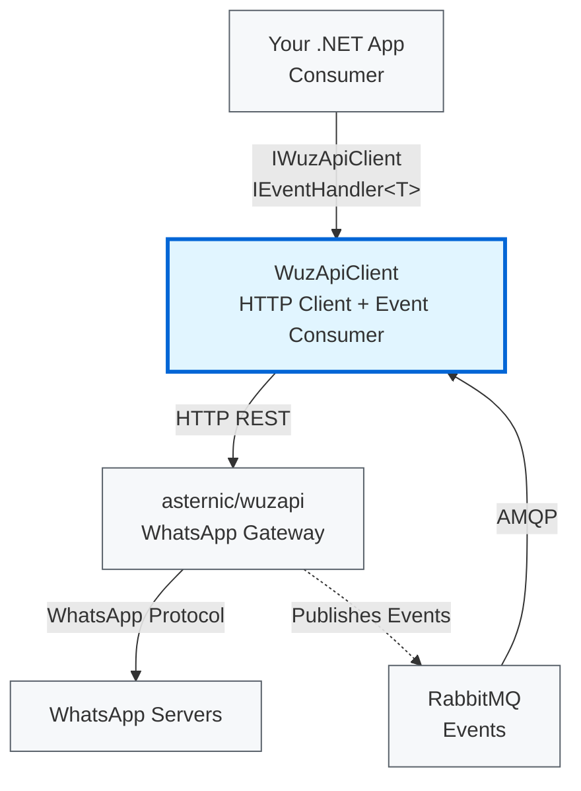

# WuzAPI Client Overview

WuzAPI Client is a .NET Standard 2.0 library that provides a type-safe interface for WhatsApp operations through the asternic/wuzapi gateway. It enables .NET applications to send messages, manage WhatsApp resources, and process incoming events.

## What Problem Does It Solve?

Integrating WhatsApp functionality into .NET applications typically requires:
- Managing HTTP communication with WhatsApp gateways
- Handling complex event payloads from WebSocket connections
- Implementing error handling and retry logic
- Processing incoming messages and events asynchronously

WuzAPI Client abstracts these complexities, providing:
- A clean, strongly-typed API for WhatsApp operations
- Railway-oriented error handling (Result pattern) instead of exceptions
- Automatic event deserialization to 44 strongly-typed event classes
- Integration with `Microsoft.Extensions.*` (DI, logging, configuration)

## Core Components

### 1. WuzApiClient (HTTP Client)

The main client library for outbound WhatsApp operations:

```csharp
public interface IWuzApiClient
{
    Task<WuzResult<SendMessageResponse>> SendTextMessageAsync(
        Phone phone,
        string message,
        string? quotedId = null,
        CancellationToken cancellationToken = default);
    Task<WuzResult<ContactsResponse>> GetContactsAsync(
        CancellationToken cancellationToken = default);
    Task<WuzResult<GroupListResponse>> GetGroupsAsync(
        CancellationToken cancellationToken = default);
    // ... 45 additional methods
}
```

**Key Features:**
- RESTful API wrapper for asternic/wuzapi gateway
- Partial class architecture organized by feature area (Messages, Contacts, Groups, etc.)
- Built on `Microsoft.Extensions.Http` with `IHttpClientFactory`
- Returns `WuzResult<T>` for predictable error handling

### 2. WuzApiClient.RabbitMq (Event Consumer)

Background service for processing incoming WhatsApp events from RabbitMQ:

```csharp
public interface IEventHandler<in TEvent>
    where TEvent : WuzEvent
{
    Task HandleAsync(TEvent evt, CancellationToken cancellationToken = default);
}
```

**Key Features:**
- Consumes events from RabbitMQ queue
- Dispatches to registered `IEventHandler<T>` implementations
- Supports event filtering via `IEventFilter`
- Configurable concurrency with `MaxConcurrentMessages`
- Scoped DI per message for proper service lifetime management

### 3. WuzApiClient.Results (Result Pattern)

Monad-based error handling library eliminating exceptions:

```csharp
public readonly struct WuzResult<T>
{
    public bool IsSuccess { get; }
    public bool IsFailure { get; }
    public T Value { get; }
    public WuzApiError Error { get; }
}
```

This follows railway-oriented programming principles, making error handling explicit and composable.

## System Context

WuzAPI Client sits between .NET applications and the asternic/wuzapi gateway:



| Dependency | Required | Purpose |
|------------|----------|---------|
| asternic/wuzapi | Yes | WhatsApp gateway providing REST API and event publishing |
| RabbitMQ | Only for events | Message broker for WhatsApp events (if using `WuzApiClient.RabbitMq`) |

You **must** run an asternic/wuzapi gateway instance for this library to function. See [asternic/wuzapi documentation](https://github.com/asternic/wuzapi/blob/main/API.md) for gateway setup.

## Target Framework

WuzAPI Client targets **.NET Standard 2.0**, providing compatibility with:
- .NET Core 2.0+
- .NET Framework 4.6.1+
- .NET 5+

## Design Philosophy

### Railway-Oriented Programming

Instead of throwing exceptions for business logic errors, the library uses the Result pattern:

```csharp
// Traditional approach (exceptions)
try {
    var response = await client.SendMessageAsync(...);
} catch (HttpRequestException ex) {
    // Handle network error
}

// WuzApiClient approach (Result pattern)
var result = await client.SendTextMessageAsync(...);
if (result.IsSuccess) {
    // Use result.Value
} else {
    // Handle result.Error (WuzApiError with Code, Message, HttpStatusCode, etc.)
}
```

This makes error handling explicit, predictable, and composable. See [Error Handling Guide](../usage/error-handling.md) for details.

### Microsoft.Extensions Patterns

The library uses standard `Microsoft.Extensions.*` patterns:

- **Dependency Injection** – Register with `AddWuzApiClient()` (3 overloads: IConfiguration, IConfigurationSection, or Action<WuzApiOptions>) and `AddWuzEvents()` (3 overloads: Action<WuzEventOptions>, IConfiguration + sectionName, or Action<WuzEventBuilder>)
- **Options Pattern** – Configure via `IOptions<WuzApiOptions>` and `IOptions<WuzEventOptions>`
- **Hosted Services** – RabbitMQ consumer runs as `IHostedService`
- **Logging** – Integrated with `ILogger<T>` throughout


### Clean Architecture

The codebase maintains clear separation of concerns:

| Layer | Responsibility | Examples |
|-------|----------------|----------|
| Interfaces | Public contracts | `IWuzApiClient`, `IEventHandler<T>` |
| Configuration | DI registration and options | `ServiceCollectionExtensions`, `WuzApiOptions` |
| Implementation | HTTP/RabbitMQ logic | `WuzApiHttpClient`, `EventConsumer` |
| Models | Data transfer objects | Request/Response DTOs, Event types |

Consumer code depends only on interfaces, not concrete implementations.

## When to Use This Library

**Good Fit:**
- Building .NET applications requiring WhatsApp messaging
- Processing WhatsApp events in real-time via RabbitMQ
- Need type-safe API with strong IntelliSense support
- Already using `Microsoft.Extensions.*` DI and Options patterns
- Want predictable error handling without exceptions

**Not a Fit:**
- Need direct WhatsApp Business API integration (this requires asternic/wuzapi gateway)
- Building non-.NET applications (use asternic/wuzapi REST API directly)
- Require webhook-based event delivery (this library uses RabbitMQ)

## Next Steps

- **New to the library?** → [Getting Started](getting-started.md)
- **Ready to handle events?** → [Event Handling Guide](../usage/event-handling.md)
- **Need configuration reference?** → [Configuration Guide](../usage/configuration.md)

