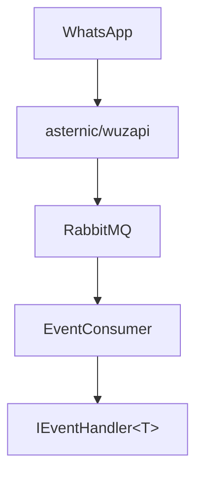

# Event Handling

Process incoming WhatsApp events via RabbitMQ.



## Setup

### 1. Register Consumer

```csharp
using WuzApiClient.RabbitMq.Configuration;

builder.Services.AddWuzEvents(builder.Configuration, b => b
    .AddHandlersFromAssembly(ServiceLifetime.Scoped, typeof(Program).Assembly)
);
```

### 2. Implement Handler

```csharp
using WuzApiClient.RabbitMq.Core.Interfaces;
using WuzApiClient.RabbitMq.Models.Events;

public sealed class MessageHandler : IEventHandler<MessageEventEnvelope>
{
    private readonly ILogger<MessageHandler> logger;
    private readonly IWaClient client;

    public MessageHandler(ILogger<MessageHandler> logger, IWaClient client)
    {
        this.logger = logger;
        this.client = client;
    }

    public async Task HandleAsync(IWuzEventEnvelope<MessageEventEnvelope> envelope, CancellationToken ct)
    {
        var @event = envelope.Payload.Event;
        var text = @event.Message?.Conversation ?? @event.Message?.ExtendedTextMessage?.Text;

        this.logger.LogInformation("From {Sender}: {Text}", @event.Info?.Sender, text);

        // Reply to message
        if (!string.IsNullOrEmpty(text) && @event.Info?.Sender != null)
        {
            var phone = Phone.Create(@event.Info.Sender.Split('@')[0]);
            await this.client.SendTextMessageAsync(phone, $"You said: {text}", cancellationToken: ct);
        }
    }
}
```

### 3. Register Handlers

```csharp
// Assembly scanning (recommended)
builder.Services.AddWuzEvents(builder.Configuration, b => b
    .AddHandlersFromAssembly(ServiceLifetime.Scoped, typeof(Program).Assembly)
);

// Or explicit registration
builder.Services.AddWuzEvents(builder.Configuration, b => b
    .AddHandler<MessageEventEnvelope, MessageHandler>(ServiceLifetime.Scoped)
    .AddHandler<ReceiptEventEnvelope, ReceiptHandler>(ServiceLifetime.Scoped)
);
```

## Event Types

See [Event Types Reference](../api/event-types-reference.md) for all 46 event types.

### Common Events

```csharp
// Text/Media messages
IEventHandler<MessageEventEnvelope>

// Delivery/Read receipts
IEventHandler<ReceiptEventEnvelope>

// Online/Offline status
IEventHandler<PresenceEventEnvelope>

// Group updates
IEventHandler<GroupInfoEventEnvelope>
```

### Media Messages

```csharp
public async Task HandleAsync(IWuzEventEnvelope<MessageEventEnvelope> envelope, CancellationToken ct)
{
    var @event = envelope.Payload.Event;
    var messageEnvelope = envelope.Payload;

    switch (@event.Info?.Type)
    {
        case "image":
            var s3Info = messageEnvelope.S3;
            var caption = @event.Message?.ImageMessage?.Caption;
            break;
        case "document":
            var fileName = messageEnvelope.FileName;
            break;
    }
}
```

### Receipts

```csharp
public async Task HandleAsync(IWuzEventEnvelope<ReceiptEventEnvelope> envelope, CancellationToken ct)
{
    var receiptEnvelope = envelope.Payload;
    switch (receiptEnvelope.State)
    {
        case "Delivered": /* ... */ break;
        case "Read": /* ... */ break;
    }
}
```

## Error Handling

By default, exceptions are logged and messages are acknowledged. Handle errors within your handler:

```csharp
public async Task HandleAsync(IWuzEventEnvelope<MessageEventEnvelope> envelope, CancellationToken ct)
{
    try
    {
        await ProcessMessageAsync(envelope.Payload.Event, ct);
    }
    catch (Exception ex)
    {
        logger.LogError(ex, "Failed to process message");
        // Custom handling: alert, dead letter queue, etc.
    }
}
```

## Concurrency

```csharp
// Sequential (preserves order)
options.MaxConcurrentMessages = 1;

// Parallel (no ordering guarantee)
options.MaxConcurrentMessages = 10;
```

## DI Lifetimes

Handlers are resolved from a scoped container per message:

```csharp
public sealed class MessageHandler : IEventHandler<MessageEventEnvelope>
{
    private readonly IWaClient client;           // Scoped
    private readonly ILogger<...> logger;        // Singleton
    private readonly MyDbContext dbContext;      // Scoped - safe to use
}
```

## Common Patterns

### Command Router

```csharp
public async Task HandleAsync(IWuzEventEnvelope<MessageEventEnvelope> envelope, CancellationToken ct)
{
    var text = envelope.Payload.Event.Message?.Conversation;
    if (string.IsNullOrEmpty(text)) return;

    var command = text.Split(' ')[0].ToLower();
    switch (command)
    {
        case "/help": await HandleHelpAsync(envelope, ct); break;
        case "/status": await HandleStatusAsync(envelope, ct); break;
    }
}
```

## Troubleshooting

| Problem | Solution |
|---------|----------|
| Handler not invoked | Verify registration, check event type matches |
| Events not arriving | Check RabbitMQ connection, queue name |
