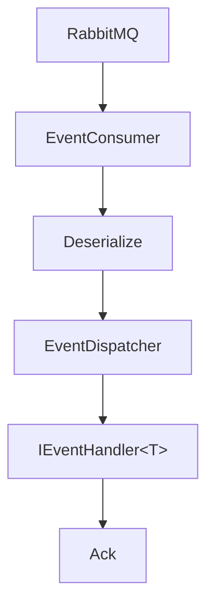

# Extension Patterns

## Extension Points

| Extension Point | Purpose |
|----------------|---------|
| `IEventHandler<TEvent>` | Handle WhatsApp events |
| `WuzEventBuilder` | Fluent API for handler registration |
| `WuzApiOptions` | Configure HTTP client |
| `WuzEventOptions` | Configure RabbitMQ consumer |

## IEventHandler\<TEvent>

Process specific WhatsApp event types.

```csharp
public interface IEventHandler<in TEvent> where TEvent : class, IWhatsAppEnvelope
{
    Task HandleAsync(IWuzEventEnvelope<TEvent> envelope, CancellationToken ct = default);
}
```

### Example

```csharp
public sealed class WelcomeHandler : IEventHandler<MessageEventEnvelope>
{
    private readonly IWaClient client;

    public WelcomeHandler(IWaClient client) => this.client = client;

    public async Task HandleAsync(IWuzEventEnvelope<MessageEventEnvelope> envelope, CancellationToken ct)
    {
        var @event = envelope.Payload.Event;
        var text = @event.Message?.Conversation ?? @event.Message?.ExtendedTextMessage?.Text;

        if (text?.ToLower().Contains("hello") == true && @event.Info?.Sender != null)
        {
            var phone = Phone.Create(@event.Info.Sender.Split('@')[0]);
            await this.client.SendTextMessageAsync(phone, "Welcome!", cancellationToken: ct);
        }
    }
}
```

### Constraints

- Must complete within RabbitMQ timeout (default: 30s)
- Long-running operations should be queued to background jobs
- Resolved per message from scoped DI container

## WuzEventBuilder

Fluent API for handler registration.

```csharp
// Assembly scanning (recommended)
builder.Services.AddWuzEvents(builder.Configuration, b => b
    .AddHandlersFromAssembly(ServiceLifetime.Scoped, typeof(Program).Assembly)
);

// Explicit registration
builder.Services.AddWuzEvents(builder.Configuration, b => b
    .AddHandler<MessageEventEnvelope, MessageHandler>(ServiceLifetime.Scoped)
    .AddHandler<ReceiptEventEnvelope, ReceiptHandler>(ServiceLifetime.Singleton)
);
```

## Configuration Options

See [Configuration Reference](configuration.md) for `WuzApiOptions` and `WuzEventOptions`.

## Processing Flow


